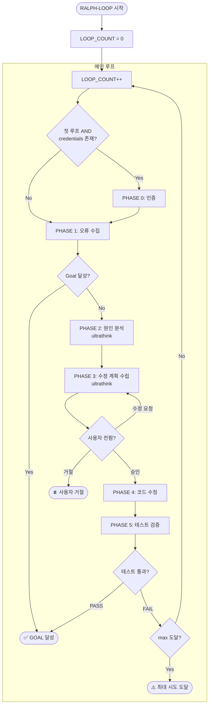
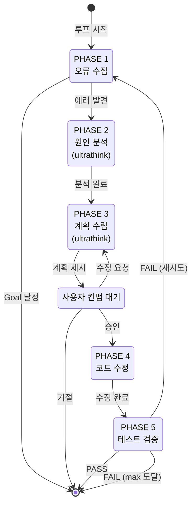

# Ralph-Loop Playwright 디버깅 스킬

## 목적

Goal에 도달할 때까지 **테스트 → 분석 → 계획 → 컨펌 → 수정 → 검증** 사이클을 반복한다.
코드 수정 전 반드시 Plan Mode를 통해 사용자 승인을 받는다.

---

## ultrathink 모드

PHASE 2(원인 분석)와 PHASE 3(수정 계획 수립)에서 **ultrathink 모드**를 사용한다.

**ultrathink 적용 단계**:
| Phase | 사고 모드 | 목적 |
|-------|----------|------|
| PHASE 2 | ultrathink | 에러의 근본 원인을 여러 가설로 검토하고 확정 |
| PHASE 3 | ultrathink | 수정 계획을 리스크 평가와 함께 체계적으로 수립 |

---

## 파라미터

| 파라미터 | 필수 | 설명 |
|---------|------|------|
| `goal` | ✅ | 달성할 목표 |
| `url` | ❌ | 테스트 대상 URL |
| `max` | ❌ | 최대 루프 횟수 (0 = 무제한) |
| `email` | ❌ | 로그인용 이메일 |
| `password` | ❌ | 로그인용 비밀번호 |

---

## 전체 흐름



---

## Phase별 실행 지침

### PHASE 0: 인증

**실행 조건**: `LOOP_COUNT == 1` AND `email`, `password` 존재

**단계**:
1. 로그인 페이지로 이동
   ```
   mcp__playwright__browser_navigate({ url: "<login-url>" })
   ```
2. 페이지 스냅샷으로 폼 요소 ref 획득
   ```
   mcp__playwright__browser_snapshot({})
   ```
3. credentials 입력 및 제출
   ```
   mcp__playwright__browser_type({ element: "Email field", ref: "<ref>", text: "<email>" })
   mcp__playwright__browser_type({ element: "Password field", ref: "<ref>", text: "<password>" })
   mcp__playwright__browser_click({ element: "Login button", ref: "<ref>" })
   ```
4. 인증 결과 확인
   ```
   mcp__playwright__browser_snapshot({})
   ```

**성공 판정**: URL 변경됨, 로그인 폼 사라짐

---

### PHASE 1: 오류 수집

**목적**: 현재 페이지 상태와 에러를 수집하고 Goal 달성 여부를 판정

**단계**:
1. 대상 페이지 이동 (url 존재시)
   ```
   mcp__playwright__browser_navigate({ url: "<url>" })
   mcp__playwright__browser_wait_for({ time: 2 })
   ```
2. 콘솔 에러 수집
   ```
   mcp__playwright__browser_console_messages({ level: "error" })
   ```
3. 페이지 스냅샷
   ```
   mcp__playwright__browser_snapshot({})
   ```
4. 스크린샷
   ```
   mcp__playwright__browser_take_screenshot({ fullPage: true })
   ```
5. 네트워크 실패 확인
   ```
   mcp__playwright__browser_network_requests({})
   ```

**Goal 달성 조건** (모두 충족):
- 콘솔 에러 없음
- 네트워크 실패 없음
- Goal에 명시된 UI/기능이 정상 동작

**Goal 달성시**: `"✅ GOAL 달성"` 출력 후 **즉시 종료**

---

### PHASE 2: 원인 분석 (ultrathink)

**목적**: 수집된 에러의 근본 원인을 깊이 있게 파악

**사고 모드**: `ultrathink` - 확장된 사고를 통해 철저히 분석

**실행 전 필수 지시**:
```
ultrathink

이 분석을 시작하기 전에 확장된 사고 모드를 활성화합니다.
다음 질문들을 단계별로 깊이 있게 검토하세요:
1. 수집된 에러들의 패턴은 무엇인가?
2. 가능한 모든 원인 가설은 무엇인가?
3. 각 가설의 가능성은 어느 정도인가?
4. 코드 추적 결과 실제 원인은 무엇인가?
5. 라이브러리 문서와 가설이 일치하는가?
```

**ultrathink 분석 프로세스**:

```
[STEP 1] 증상 정리
- 수집된 모든 에러 메시지 나열
- 에러 발생 시점과 조건 파악
- 에러 간 연관성 분석

[STEP 2] 가설 수립
- 가능한 원인들을 모두 나열
- 각 가설의 가능성 평가 (높음/중간/낮음)
- 가장 유력한 가설 선정

[STEP 3] 코드 추적
- 에러 스택 트레이스에서 파일 경로, 라인 번호 추출
- 해당 소스 코드를 Read 도구로 확인
- 호출 체인 역추적 (caller → callee)
- 관련 import/export, 의존성 확인

[STEP 3.5] 라이브러리 문서 학습
- STEP 3에서 확인된 의존성 라이브러리 목록 추출
- Context7 MCP를 사용하여 라이브러리 문서 조회:
  1. mcp__context7__resolve-library-id로 라이브러리 ID 확인
     ```
     mcp__context7__resolve-library-id({
       libraryName: "<라이브러리명>",
       query: "<에러와 관련된 검색 쿼리>"
     })
     ```
  2. mcp__context7__query-docs로 관련 문서 학습
     ```
     mcp__context7__query-docs({
       libraryId: "<확인된 라이브러리 ID>",
       query: "<에러 해결에 필요한 구체적 질문>"
     })
     ```
- 에러와 관련된 API 사용법, 베스트 프랙티스 파악
- 라이브러리 버전 호환성 및 breaking changes 확인

[STEP 3.7] 가설 교차 검증
- STEP 2의 가설과 STEP 3.5에서 학습한 라이브러리 문서 비교
- 공식 문서 기준으로 현재 코드의 사용법이 올바른지 검증
- 검증 결과에 따른 가설 상태 업데이트:
```
  | 검증 결과 | 가설 상태 | 다음 행동 |
  |----------|----------|----------|
  | 문서와 일치 | confirmed | 신뢰도 상향, STEP 4 진행 |
  | 문서와 불일치 | revised | 가설 수정 후 재검증 |
  | 문서에서 명시적 금지 | rejected | 가설 기각, 새 가설 수립 |
```
- 문서에서 권장하는 패턴과 현재 코드 패턴 비교
- Deprecated API 사용 여부 확인

[STEP 4] 근본 원인 확정
- 직접 원인 vs 간접 원인 구분
- 수정해야 할 정확한 위치 결정
- 수정 시 영향 범위 평가

[STEP 5] 대안 검토
- 가능한 해결 방법들 나열
- 각 방법의 장단점 비교
- 최적의 수정 방향 선택
```

**결과물**:
```yaml
analysis:
  error_type: "<TypeError|NetworkError|...>"
  symptoms:
    - "<증상 1>"
    - "<증상 2>"
  hypotheses:
    - hypothesis: "<가설 1>"
      likelihood: high|medium|low
    - hypothesis: "<가설 2>"
      likelihood: high|medium|low
  root_cause: "<확정된 근본 원인>"
  target_files:
    - path: "<파일>"
      line: <라인>
      reason: "<이 파일을 수정해야 하는 이유>"
  impact_scope: "<수정 시 영향 범위>"
  fix_direction: "<선택된 수정 방향>"
  alternatives_considered:
    - "<검토했지만 선택하지 않은 대안>"
  libraries_referenced:
    - name: "<라이브러리명>"
      version: "<버전>"
      docs_consulted: "<참조한 문서 섹션>"
      key_findings: "<문서에서 발견한 핵심 정보>"
      validation_result: "confirmed|revised|rejected"
```

---

### PHASE 3: 수정 계획 수립 (ultrathink)

**목적**: 체계적인 코드 수정 계획을 수립하고 사용자 승인을 받음

**사고 모드**: `ultrathink` - 확장된 사고를 통해 완벽한 계획 수립

**실행 전 필수 지시**:
```
ultrathink

이 계획 수립을 시작하기 전에 확장된 사고 모드를 활성화합니다.
다음 질문들을 단계별로 깊이 있게 검토하세요:
1. 수정이 필요한 모든 파일은 무엇인가?
2. 각 변경의 잠재적 부작용은 무엇인가?
3. 최적의 실행 순서는 무엇인가?
4. 실패 시 롤백 전략은 무엇인가?
5. 성공을 어떻게 검증할 것인가?
```

**ultrathink 계획 수립 프로세스**:

```
[STEP 1] 수정 범위 정의
- 수정이 필요한 모든 파일 목록화
- 각 파일의 수정 우선순위 결정
- 파일 간 의존성 순서 파악

[STEP 2] 상세 변경 사항 설계
- 각 파일별 구체적인 코드 변경 내용
- 변경 전/후 코드 명시
- 변경이 필요한 정확한 이유

[STEP 3] 리스크 평가
- 각 변경의 잠재적 부작용 검토
- 회귀 버그 가능성 평가
- 타입 안전성 검토

[STEP 4] 실행 순서 최적화
- 의존성 기반 실행 순서 결정
- 롤백 가능한 단계 구분
- 검증 포인트 설정

[STEP 5] 예상 결과 시뮬레이션
- 수정 후 예상되는 동작
- 성공 기준 명확화
- 실패 시 대응 방안
```

**출력 형식**:
```
═══════════════════════════════════════
📋 수정 계획 (LOOP #N) - ultrathink
═══════════════════════════════════════

## 문제 요약
- Goal: <goal>
- 에러: <error_type>
- 근본 원인: <root_cause>
- 영향 범위: <impact_scope>

## 수정 계획

### Step 1: <작업명>
- 파일: `<path>`
- 변경 전:
  ```
  <before_code>
  ```
- 변경 후:
  ```
  <after_code>
  ```
- 이유: <reason>
- 리스크: <potential_risk>

### Step 2: ...

## 실행 순서
1. <첫 번째로 수정할 파일> (이유: <why_first>)
2. <두 번째로 수정할 파일> (이유: <why_second>)
...

## 예상 결과
- <수정 후 예상 동작>

## 성공 기준
- [ ] <검증 항목 1>
- [ ] <검증 항목 2>

## 리스크 및 대응
- 리스크: <potential_issue>
- 대응: <mitigation_plan>
═══════════════════════════════════════
```

**사용자 컨펌 요청**:
```
AskUserQuestion({
  questions: [{
    question: "위 수정 계획을 승인하시겠습니까?",
    header: "계획 승인",
    options: [
      { label: "승인", description: "계획대로 수정 진행" },
      { label: "수정 요청", description: "계획 수정 후 재검토" },
      { label: "거절", description: "루프 종료" }
    ],
    multiSelect: false
  }]
})
```

**응답 처리**:
| 응답 | 다음 단계 |
|------|----------|
| 승인 | PHASE 4 진행 |
| 수정 요청 | 피드백 반영 후 PHASE 3 재실행 |
| 거절 | `"⏸️ 사용자 거절"` 출력 후 종료 |

---

### PHASE 4: 코드 수정

**전제조건**: 사용자가 PHASE 3의 계획을 승인함

**원칙**:
- 승인된 계획 범위 내에서만 수정
- 최소 변경 원칙 준수
- 기존 코드 스타일 유지

**단계**:
1. 대상 파일 Read
2. 계획된 순서대로 Edit 적용
3. 타입 검사 (필요시)
   ```
   bun run typecheck
   ```

---

### PHASE 5: 테스트 검증

**목적**: 수정 사항이 문제를 해결했는지 확인

**단계**:
1. 페이지 새로고침
   ```
   mcp__playwright__browser_navigate({ url: "<url>" })
   mcp__playwright__browser_wait_for({ time: 2 })
   ```
2. 에러 재확인
   ```
   mcp__playwright__browser_console_messages({ level: "error" })
   ```
3. 상태 확인
   ```
   mcp__playwright__browser_snapshot({})
   mcp__playwright__browser_take_screenshot({ fullPage: true })
   ```

**PASS 조건** (모두 충족):
- 기존 에러 해결됨
- 새로운 에러 없음
- Goal 조건 충족

**FAIL 조건** (하나라도 해당):
- 동일 에러 재발
- 새로운 에러 발생
- Goal 미충족

**결과 처리**:
| 결과 | 다음 단계 |
|------|----------|
| PASS | `"✅ GOAL 달성"` 출력 후 종료 |
| FAIL + max 미도달 | 다음 루프 (PHASE 1로) |
| FAIL + max 도달 | `"⚠️ 최대 시도 도달"` 출력 후 종료 |

---

## 상태 전이 다이어그램



---

## 출력 형식

**루프 시작**:
```
═══════════════════════════════════════
RALPH-LOOP #N
Goal: <goal>
═══════════════════════════════════════
```

**Phase 진행**:
```
[1/5] 오류 수집 중...
[2/5] 원인 분석 중... (ultrathink 모드)
[3/5] 수정 계획 수립 중... (ultrathink 모드)
[4/5] 코드 수정 중...
[5/5] 테스트 검증 중...
```

**루프 종료**:
```
───────────────────────────────────────
결과: PASS/FAIL
다음: 종료/LOOP #N+1 진행
───────────────────────────────────────
```

---

## 에러 패턴 참조

| 패턴 | 원인 | 해결 방향 |
|------|------|----------|
| `Cannot read property 'X' of undefined` | null 참조 | 옵셔널 체이닝 |
| `Failed to fetch` | API 실패 | 서버/CORS 확인 |
| `Unexpected token` | JSON 파싱 오류 | 응답 형식 확인 |
| `401 Unauthorized` | 인증 실패 | 토큰 로직 확인 |
| `404 Not Found` | 경로 오류 | 라우트 확인 |

---

## 종료 코드

| 상황 | 메시지 | 의미 |
|------|--------|------|
| Goal 달성 | ✅ GOAL 달성 (N회) | 성공 |
| 사용자 거절 | ⏸️ 사용자 거절 | 중단 |
| Max 도달 | ⚠️ 최대 시도 도달 | 부분 실패 |
| 치명적 오류 | ❌ 복구 불가 | 실패 |
